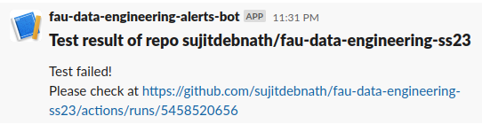

> _This repository contains data engineering and data science projects and exercises using open data sources as part of the [AMSE](https://oss.cs.fau.de/teaching/specific/amse/)/[SAKI](https://oss.cs.fau.de/teaching/specific/saki/) course, taught by the [FAU Chair for Open-Source Software (OSS)](https://oss.cs.fau.de/) in the Summer'23 semester. This repo is forked from [2023-amse-template repository](https://github.com/jvalue/2023-amse-template)._


# Impact of Weather and Climate on Bicycle Traffic in Köln

This project aims to analyze **the weather and climate conditions of Köln and its bicycle traffic** generated from several [automatic counting stations](http://www.eco-public.com/ParcPublic/?id=677) throughout the city to determine if Köln is a suitable city for an enthusiastic cyclist to live in. The project is using two open data sources: [Mobilithek Bicycle Traffic Data](https://mobilithek.info/offers/-2236641647976866002), which contains information on bicycle traffic in Köln, and [Meteostat Weather and Climate Data](https://dev.meteostat.net/bulk/monthly.html), which provides weather and climate data of Köln. For details see the [project plan](/project/project-plan.md).

## Project Structure

```bash
project/
├── config/                     # Configuration files and settings
│   ├── __init__.py
│   ├── config_var.py           # Configuration variables
│   └── source_info.json        # Source information
├── data/                       # Data directory
│   ├── processed/              # Processed data
│   └── raw/                    # Raw data
├── etl/                        # ETL (Extract, Transform, Load) pipeline modules
│   ├── __init__.py
│   ├── extract/                # Extraction module
│   │   ├── __init__.py
│   │   └── data_extractor.py   # Data extraction logic
│   ├──transform/               # Transformation module
│   │   ├── __init__.py
│   │   └── data_transformer.py # Data transformation logic
│   └── load/                   # Loading module
│       ├── __init__.py
│       └── data_loader.py      # Data loading logic
├── pipelines/                  # Data pipeline modules
│   ├── __init__.py
│   └── data_pipeline.py        # ETL data pipeline implementation
├── utils/                      # Utility modules
│   ├── __init__.py
│   └── service_factory.py      # Service factory utility
├── tests/                      # Test modules
│   ├── __init__.py
│   ├── test_component.py       # Test cases for component testing
│   ├── test_pipeline.py        # Test cases for system testing
│   └── transformed_data.pkl    # Original transformed data for testing purposes
├── main.py                     # Entry point of the project
├── tests.sh                    # Bash script for running all the test cases
├── exploration.ipynb           # Notebook for data exploration
├── report.ipynb                # Notebook for final project report
├── slides.pdf                  # Presentation slides of the project
└── project-plan.md             # Project plan and documentation
```

**Important files of the project and their roles:**

- `project/main.py`: It will run an automated ETL pipeline that creates an SQLite database named `fau_data_engineering_ss23.sqlite` that contains two tables representing two open data sources of the project.
- `project/tests.sh`: A bash script that will execute the component and system-level testing for the project by calling two other Python scripts, `project/tests/test_component.py`, and `project/tests/test_pipeline.py` respectively.
- `project/report.ipynb`: This Jupyter notebook serves as the final report for the project, providing a comprehensive exploration of all aspects and findings. The report primarily investigates the impact of weather conditions in Köln on bicycle traffic throughout the year, addressing various key questions, based on the data in `fau_data_engineering_ss23.sqlite`. See the [report](project/report.ipynb).

**Continuous Integration Pipeline using GitHub Action:** <br>

A Continuous Integration pipeline has been implemented using a GitHub action defined in [.github/workflows/ci-tests.yml](.github/workflows/ci-tests.yml). This pipeline is triggered whenever changes are made to the `project/` directory (with a few exceptions: `exploration.ipynb`, `report.ipynb`, `slides.pdf`, `project-plan.md`) and pushed to the GitHub repository, or when a pull request is created and merged into the `main` branch. The `ci-tests.yml` workflow executes the `project/tests.sh` test script, and in case of any failures, it sends an error message to the respective [Slack Channel](https://slack.com/), as shown in the sample screenshot below:



## Project Setup

1. Clone this git repository
```bash
git clone https://github.com/sujitdebnath/fau-data-engineering-ss23.git
```
2. Install [Python](https://www.python.org/). Then create a virtual environment inside the repo and activate it.
```bash
python3 -m venv <env_name>
source <env_name>/bin/activate
```
3. Download and install the required Python packages for the project.
```bash
pip install -r requirements.txt
```
4. To run the project, go to the `project/` directory and run the `main.py` script. It will run the whole ETL pipeline and generate an SQLite database named `fau_data_engineering_ss23.sqlite` that contains two tables, `mobilithek_bicycle_traffic` and `meteostat_weather_data`, representing two open data sources of the project.
```bash
cd project/
python3 main.py
```
5. To run the test script which will execute the component and system-level testing for the project, run the following command.
```bash
chmod +x tests.sh
sh tests.sh
```
6. Finally, run and explore the `project/report.ipynb` project notebook, and also feel free to modify it.

## Exercises (not part of the project)

During the semester we had to complete exercises, sometimes using [Python](https://www.python.org/), and sometimes using [Jayvee](https://github.com/jvalue/jayvee). Automated exercise feedback is provided using a GitHub action that is defined in [.github/workflows/exercise-feedback.yml](.github/workflows/exercise-feedback.yml).

1. [exercises/exercise1.jv](exercises/exercise1.jv)
2. [exercises/exercise2.py](exercises/exercise2.py)
3. [exercises/exercise3.jv](exercises/exercise3.jv)
4. [exercises/exercise4.py](exercises/exercise4.py)
5. [exercises/exercise5.jv](exercises/exercise5.jv)

The exercise feedback is executed whenever we make a change in files in the `exercise/` directory and push our local changes to the repository on GitHub. To see the feedback, open the latest GitHub Action run, and open the `exercise-feedback` job and `Exercise Feedback` step.
